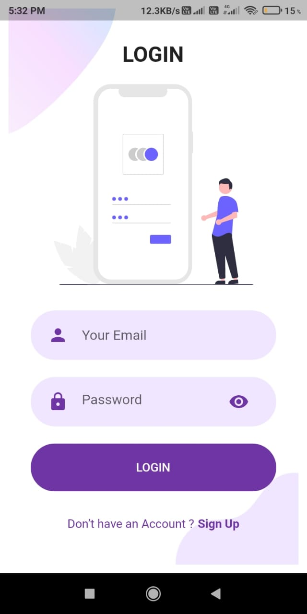
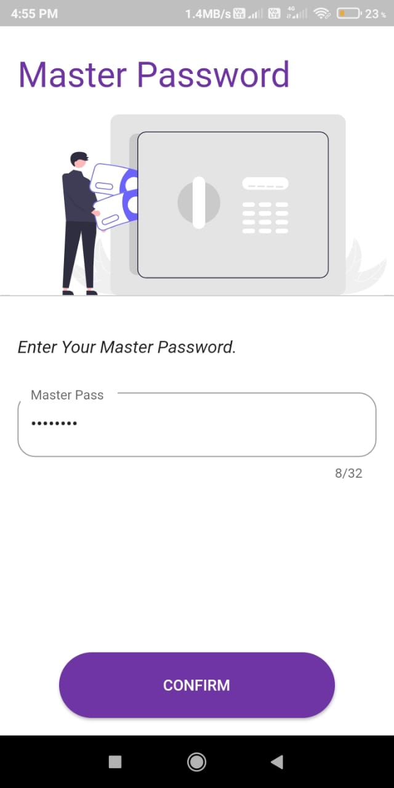
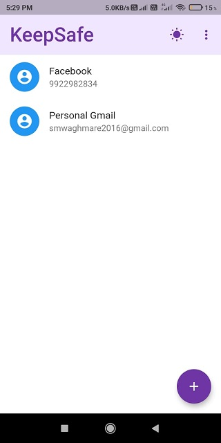
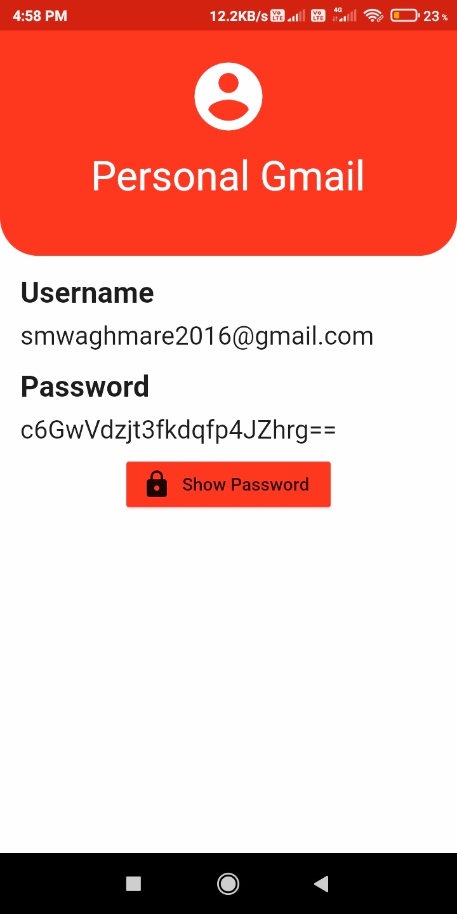
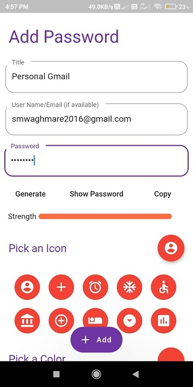

# KeepSafe
## Manage your passwords Securely on Cloud

App built using flutter, at backend side nodejs,express used for creating RestApi's and MongoDb database is used to store all passwords.

\nA Master password is used as a key to encrypt all passwords.Encrypts all passwords on client side only and stored on database.

\nMaster password is never stored on database, using SHA hashing is used to validate Master password.

Download Android App[here](https://github.com/saurabh-m-w/PasswordManager/raw/main/KeepSafeApp.apk)

